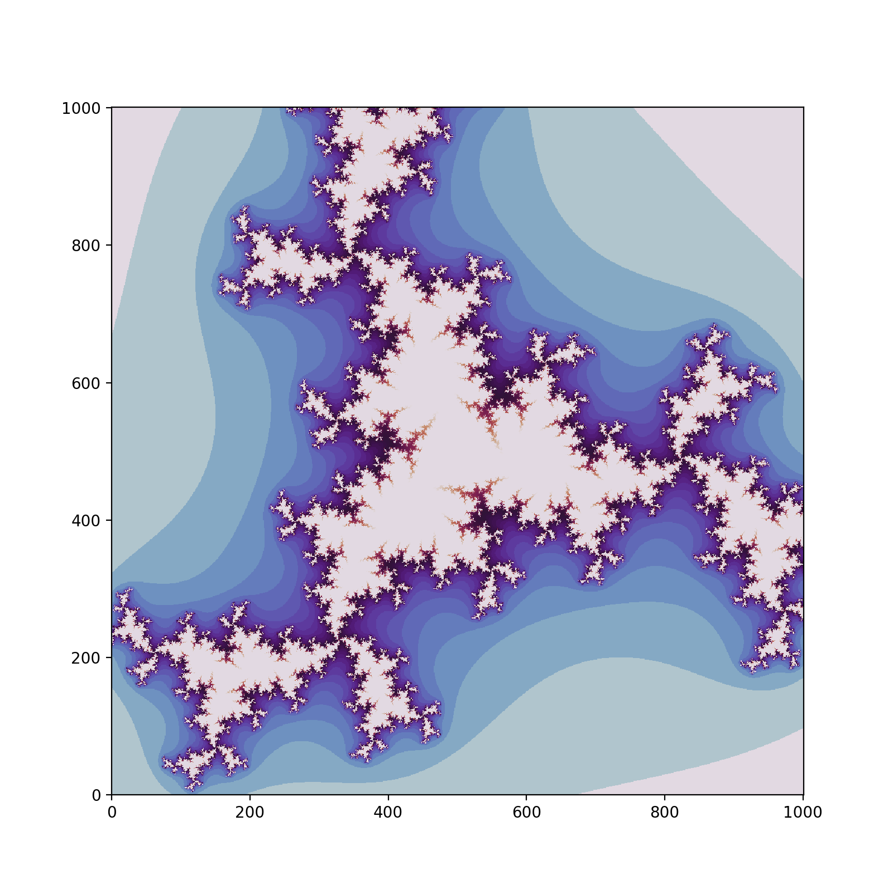

# Репозиторий множества Жюлиа и Визуализатора

Этот репозиторий содержит реализации множества Жюлиа с и без использования Numba, а также приложение для визуализации множества Жюлиа.

## 1. Реализация множества Жюлиа без Numba

В этой части репозитория находится Python-код для вычисления и визуализации множества Жюлиа без использования Numba. Вы можете настроить параметры визуализации и исследовать красивые и хаотичные фрактальные узоры множества Жюлиа.

## 2. Реализация множества Жюлиа с Numba

Этот раздел содержит Python-код, который использует Numba для ускорения вычисления множества Жюлиа. Этот вариант кода работает намного быстрее и позволяет вам более быстро исследовать множество Жюлиа.

## 3. Приложение для визуализации множества Жюлиа

Здесь вы найдете Python-приложение, которое использует реализацию множества Жюлиа с использованием Numba для визуализации множества Жюлиа в реальном времени. Вы можете настроить параметры визуализации, включая размер окна, максимальное количество итераций, область построения, радиус сходимости и цветовую карту, чтобы исследовать множество Жюлиа и наблюдать за его изменениями.

## Использование

Для использования кода из этого репозитория вам потребуются следующие библиотеки:

- `numpy`
- `pygame`
- `numba` (только для варианта с Numba)
- `matplotlib` (только для варианта с Numba)
- `PySimpleGUI` (только для приложения)

Вы можете запустить код и настроить параметры визуализации, чтобы исследовать разнообразные фрактальные узоры множества Жюлиа.

## Параметры визуализации

В приложении с графическим интерфейсом можно настроить следующие параметры визуализации:

- Ширина и высота окна
- Максимальное количество итераций
- Минимальное и максимальное значения по осям Ox и Oy
- Радиус сходимости
- Выбор цветовой карты для визуализации

## Примеры использования

Примеры будут показаны для функии вида f(z) = z3 + c

1. c = -0.4800 - 0.5950j:

2. c = 0.5200 - 0.1250j:

3. c = 0.4950 - 0.6000j:

4. c = -0.5900 - 0.6100j:

5. c = -0.5750 + 0.6000j:

6. c = -0.3600 - 0.6850j:

7. c = 0.0850 - 0.7850j:

## Лицензия

Код в этом репозитории предоставляется под [Лицензией MIT](LICENSE). Вы можете свободно использовать, модифицировать и распространять его в соответствии с условиями лицензии.

